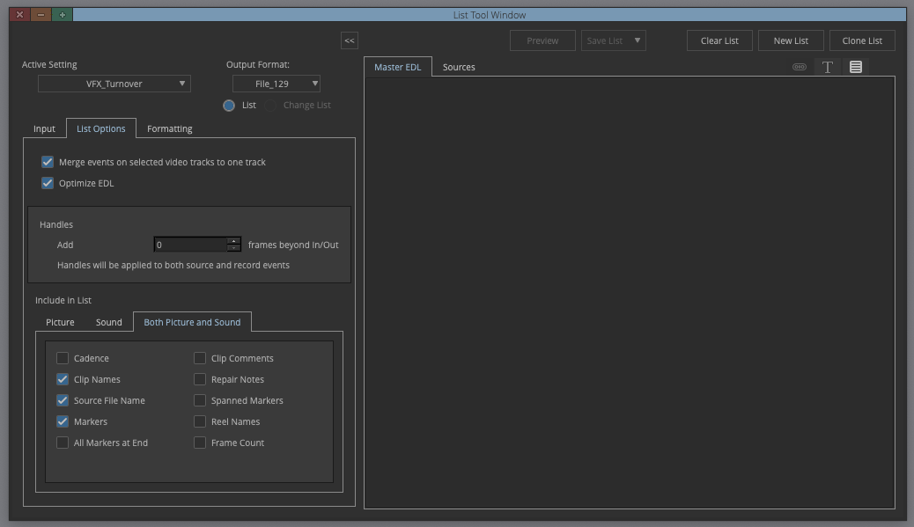
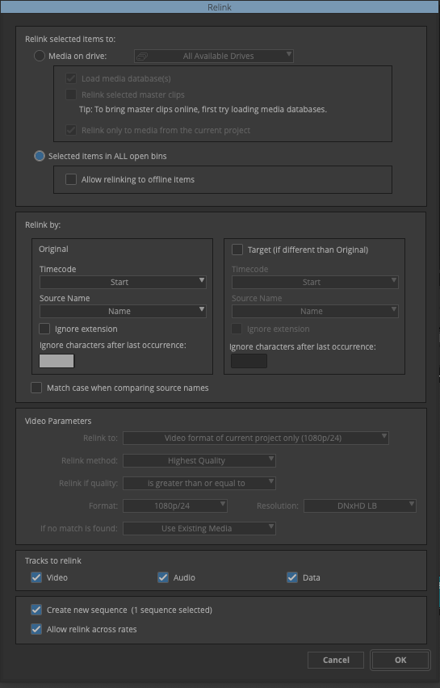

## Python script to help manage the VFX workflow in Avid Media Composer

[](LICENSE)

### Installation

Requires Python 3.10+ and [pipx](https://pipx.pypa.io).

```bash
git clone https://github.com/pnardese/vfx_turnover.git
cd vfx_turnover
pipx install -e .
```

The `vfx-turnover` command will be available system-wide without activating a virtual environment.

To update after pulling new changes:
```bash
pipx reinstall vfx-turnover
```

### Supported EDL Formats

- **Avid File_129 EDL** - Standard Avid Media Composer EDL format
- **CMX3600 EDL** - Industry standard CMX3600 format

---

## Workflow Guide

### 1. Create EDL from Avid

Create an EDL (File_129 or CMX3600) from the Avid video track containing only shots planned for VFX, simplify timeline by removing transitions, effects and committing groups. In List Options in Avid, check: **Clip Names**, **Source File Name**, and **Markers**.

VFX IDs are generated automatically based on scene numbers: `FILM_ID_Scene_num`, where `num` is a progressive number like 010, 020, 030, etc.

Existing markers on the timeline are imported as existing VFX IDs (found in the EDL as `*LOC` lines). If you add VFX shots in Avid, add markers with their new VFX IDs before re-importing.



Import the EDL into the project:
```
vfx-turnover -e timeline.edl
```

### 2. Export Markers and Subcaps

Export markers and subcaps and import them into Avid to help keep track of VFX shots.

```
vfx-turnover -m
vfx-turnover -s
```

When exporting markers (`-m`), the script prompts for:

| Option | Choices | Default |
|--------|---------|---------|
| AVID user name | any string | `vfx` |
| Track | `TC`, `V1`–`V8` | `V1` |
| Marker color | `green`, `red`, `blue`, `cyan`, `magenta`, `yellow`, `black`, `white` | `green` |
| Marker position | `start`, `middle` | `middle` |

### 3. Export AAF with Clip Notes

As an alternative to markers, VFX IDs can be embedded as clip notes directly on each shot in the sequence. Export the sequence as AAF from Avid, then run:

```
vfx-turnover -n sequence.aaf
```

The script automatically detects the video track from the AAF. It also writes timeline markers on the same track. The output AAF is saved next to the original EDL with `_new` appended to the filename (e.g. `VFX_48_new.aaf`).

When running `-n`, the script prompts for:

| Option | Choices | Default |
|--------|---------|---------|
| AVID user name | any string | `vfx` |
| Marker color | `green`, `red`, `blue`, `cyan`, `magenta`, `yellow`, `black`, `white` | `green` |
| Marker position | `start`, `middle` | `middle` |
| Clip color | `none`, or any of 32 Avid clip colors | `none` |

The clip color prompt displays a 4-column grid with color swatches. Colors are written as `_COLOR_R/G/B` tagged values in the AAF's `ComponentAttributeList`, matching the format Avid uses natively.

### 4. Export Frames

Export markers from Avid as JPGs to use them to build a VFX shots database.


### 5. Export TAB Text File

Export a TAB-delimited file with VFX IDs info, importable in any database or spreadsheet to build a VFX shot database.

```
vfx-turnover -t
```

The exported file contains one row per shot with the following columns:

| Column | Description |
|--------|-------------|
| `#` | Shot counter |
| `Name` | VFX ID |
| `Frame` | *(empty — for thumbnail reference)* |
| `Comments` | *(empty)* |
| `Status` | *(empty)* |
| `Date` | *(empty)* |
| `Duration` | Source clip duration as timecode |
| `Start` | Source start timecode |
| `End` | Source end timecode |
| `Frame Count Duration` | Duration in frames |
| `Handles` | Handle frames configured for the project |
| `Tape` | Source reel / tape name |

### 6. Export ALE Pulls

Export ALE Pulls to create pulls (subclips named with VFX IDs from master clips). After selecting master clips in the bin, drag the ALE file onto the bin. Import settings: *Merge events with known sources and automatically create subclips*.

```
vfx-turnover -p
```


### 7. Export Pulls EDL

Export a Pulls EDL to create a timeline with pull subclips. Import the EDL into an Avid bin and relink to pull subclips using Names.

```
vfx-turnover -c
```



### 8. VFX Cut-ins

When you receive incoming VFX (`.mov` files), import them into Avid, then export the bin in TAB format. Use the TAB file to generate an EDL for cutting the VFX into the timeline. Required bin columns: **Color**, **Name**, **Duration**, **Start**, **End**, **Tape**.

```
vfx-turnover -f avid_bin.txt
```


---

## All Options

| Option | Description |
|--------|-------------|
| `-e timeline.edl` | Import an EDL and create/update the project file |
| `-m` | Export a marker text file for Avid (interactive options) |
| `-s` | Export a subcaps text file for Avid |
| `-p` | Export an ALE for creating pulls in Avid bin |
| `-c` | Export an EDL for cutting in pulls |
| `-t` | Export a TAB-delimited text file for spreadsheet import |
| `-n source.aaf` | Export an AAF with VFX ID clip notes (requires source AAF) |
| `-f avid_bin.txt` | Export an EDL to cut in final VFX shots (requires Avid bin TAB) |

All exported files are saved in the same folder as the original EDL.

---

## Settings

| Setting | Description | Default |
|---------|-------------|---------|
| Film ID | Project identifier used in VFX IDs | `FILM_ID` |
| FPS | Frame rate for timecode calculations | `24` |
| Handles | Extra frames added to pulls | `10` |

Project settings are persisted at:

```
~/.config/vfx_turnover/vfx_project.json
```

This file is created automatically on first run and stores parameters such as the project name and configuration values, so they don't need to be re-entered each session.
